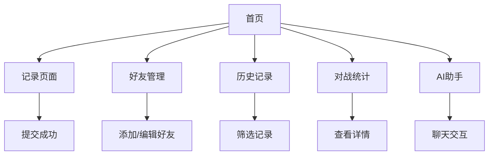

## 1. 产品概述
将现有微信小程序"我和朋友的计分器"完整复刻为Web端应用。这是一个专为麻将爱好者设计的个人计分管理工具，用于记录和管理与朋友的麻将游戏成绩。

产品核心价值：简化麻将记分流程，提供直观的战绩统计和分析，帮助用户追踪游戏表现。

## 2. 核心功能

### 2.1 用户角色
本产品为单用户个人使用，无需注册登录，直接访问即可使用所有功能。

### 2.2 功能模块
计分器Web应用包含以下核心页面：
1. **首页**：功能导航、快速入口、应用介绍
2. **记录页面**：添加游戏记录、选择参与玩家、输入得分
3. **好友管理页面**：添加/编辑好友、选择头像emoji、查看好友列表
4. **历史记录页面**：查看所有游戏记录、筛选和搜索、删除记录
5. **对战统计页面**：玩家战绩统计、胜率分析、得分排名
6. **AI助手页面**：智能聊天助手、麻将规则咨询、技巧建议

### 2.3 页面详情

| 页面名称 | 模块名称 | 功能描述 |
|---------|---------|---------|
| 首页 | 导航区域 | 显示应用标题，提供各功能模块入口按钮 |
| 首页 | 功能卡片 | 展示记录、好友、历史、统计四个核心功能入口 |
| 记录页面 | 游戏记录表单 | 动态添加/删除玩家记录行，选择玩家和输入得分 |
| 记录页面 | 提交功能 | 一键提交所有记录，自动计算总分 |
| 好友管理 | 好友列表 | 展示所有好友头像、名称，支持编辑和删除 |
| 好友管理 | 添加好友 | 输入好友名称，随机分配动物emoji头像 |
| 好友管理 | 编辑功能 | 修改好友名称和头像，实时更新 |
| 历史记录 | 记录列表 | 按时间倒序展示所有游戏记录 |
| 历史记录 | 搜索筛选 | 按玩家名称筛选特定记录 |
| 历史记录 | 删除功能 | 单条记录删除，确认提示 |
| 对战统计 | 统计概览 | 显示所有玩家总得分、胜率、对战次数 |
| 对战统计 | 详细统计 | 点击玩家查看详细对战记录 |
| AI助手 | 聊天界面 | 支持文字输入，AI回复麻将相关问题 |
| AI助手 | 历史消息 | 保存聊天记录，支持清空对话 |

## 3. 核心流程

### 主要用户操作流程：
1. **记录游戏成绩**：进入记录页面 → 添加玩家记录 → 选择玩家 → 输入胜负和得分 → 提交保存
2. **管理好友**：进入好友页面 → 点击添加好友 → 输入名称 → 自动生成头像 → 保存
3. **查看历史**：进入历史页面 → 浏览记录列表 → 可按玩家筛选 → 查看详情或删除
4. **查看统计**：进入统计页面 → 查看所有玩家战绩 → 点击玩家查看详细记录
5. **使用AI助手**：进入AI助手 → 输入问题 → 获得麻将相关建议和回答

## 4. 用户界面设计

### 4.1 设计风格
- **主色调**：温暖橙色(#FF6B35)和深灰色(#2C3E50)
- **辅助色**：浅灰色(#ECF0F1)、白色背景
- **按钮风格**：圆角矩形，悬浮效果，主要操作用橙色
- **字体**：系统默认字体，标题16px，正文14px
- **布局风格**：卡片式布局，响应式网格，移动端优先
- **图标风格**：使用emoji表情作为头像，简洁直观

### 4.2 页面设计概览

| 页面名称 | 模块名称 | UI元素 |
|---------|---------|---------|
| 首页 | 导航栏 | 橙色背景，白色标题"麻将计分器" |
| 首页 | 功能卡片 | 2x2网格布局，橙色图标，白色背景，圆角卡片 |
| 记录页面 | 记录表单 | 白色卡片，每行包含玩家选择器、胜负选择、分数输入 |
| 记录页面 | 操作按钮 | 底部固定，橙色提交按钮，绿色添加按钮 |
| 好友管理 | 好友列表 | 横向滚动卡片，显示emoji头像和名称 |
| 好友管理 | 添加表单 | 底部弹出层，输入框和emoji选择器 |
| 历史记录 | 记录卡片 | 时间分组显示，每局记录可展开查看详情 |
| 对战统计 | 统计卡片 | 排行榜样式，显示排名、头像、名称、胜率 |
| AI助手 | 聊天界面 | 类似微信聊天，左侧AI回复，右侧用户输入 |

### 4.3 响应式设计
采用移动端优先设计，支持以下断点：
- 手机端(< 768px)：单栏布局，全屏显示
- 平板端(768px - 1024px)：适配中等屏幕，优化触控体验
- 桌面端(> 1024px)：最大宽度1200px，居中显示

### 4.4 交互设计
- 点击反馈：所有可点击元素都有hover和active状态
- 加载状态：数据加载时显示骨架屏或loading动画
- 操作确认：删除等重要操作需要二次确认
- 错误提示：使用toast或modal展示错误信息
- 成功反馈：操作成功后显示成功提示