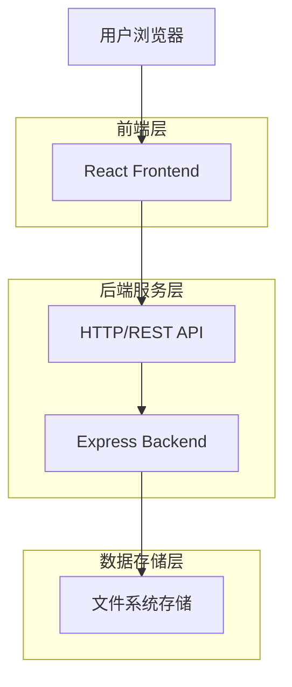
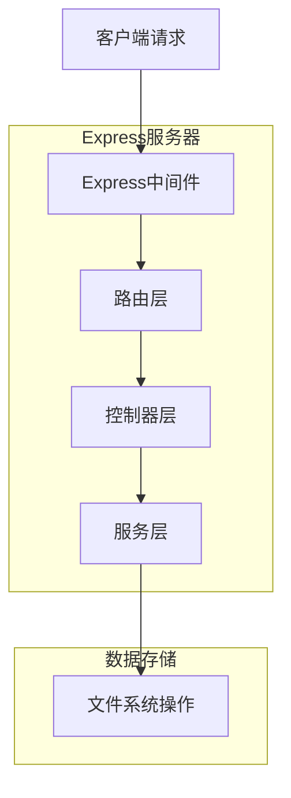

## 1. 架构设计

采用前后端分离架构，前端使用React构建SPA应用，后端使用Node.js + Express提供RESTful API服务，数据以JSON文件形式存储在服务器本地文件系统中。



## 2. 技术描述

- **前端**: React@18 + Vite + TailwindCSS
- **初始化工具**: vite-init
- **后端**: Node.js@18 + Express@4
- **数据存储**: 本地JSON文件存储（无需数据库）
- **部署**: Nginx反向代理，支持静态文件服务和API转发

## 3. 路由定义

### 前端路由
| 路由 | 用途 |
|-------|---------|
| / | 首页，功能导航入口 |
| /record | 记录页面，添加游戏记录 |
| /friends | 好友管理页面，添加编辑好友 |
| /history | 历史记录页面，查看所有记录 |
| /stats | 对战统计页面，查看战绩统计 |
| /ai-assistant | AI助手页面，智能聊天功能 |

### 后端API路由
| 路由 | 用途 |
|-------|---------|
| GET /api/friends | 获取好友列表 |
| POST /api/friends | 添加新好友 |
| PUT /api/friends/:id | 更新好友信息 |
| DELETE /api/friends/:id | 删除好友 |
| GET /api/records | 获取游戏记录列表 |
| POST /api/records | 添加游戏记录 |
| DELETE /api/records/:id | 删除游戏记录 |
| GET /api/stats | 获取对战统计数据 |
| POST /api/ai/chat | AI聊天接口 |

## 4. API定义

### 4.1 好友管理API

**获取好友列表**
```
GET /api/friends
```

响应:
```json
{
  "success": true,
  "data": [
    {
      "id": "friend_123",
      "name": "张三",
      "emoji": "🐶",
      "createTime": "2024-01-01T00:00:00.000Z"
    }
  ]
}
```

**添加好友**
```
POST /api/friends
```

请求:
```json
{
  "name": "李四",
  "emoji": "🐱"
}
```

**更新好友**
```
PUT /api/friends/:id
```

请求:
```json
{
  "name": "李四新名字",
  "emoji": "🦁"
}
```

### 4.2 游戏记录API

**获取游戏记录**
```
GET /api/records?page=1&limit=10&friendId=xxx
```

响应:
```json
{
  "success": true,
  "data": [
    {
      "id": "record_123",
      "createTime": "2024-01-01T00:00:00.000Z",
      "records": [
        {
          "friendId": "friend_123",
          "friendName": "张三",
          "type": "胜",
          "score": "100"
        }
      ],
      "totalScore": 0
    }
  ],
  "pagination": {
    "page": 1,
    "limit": 10,
    "total": 50
  }
}
```

**添加游戏记录**
```
POST /api/records
```

请求:
```json
{
  "records": [
    {
      "friendId": "friend_123",
      "friendName": "张三",
      "type": "胜",
      "score": "100"
    },
    {
      "friendId": "friend_456",
      "friendName": "李四",
      "type": "负",
      "score": "50"
    }
  ]
}
```

### 4.3 统计数据API

**获取对战统计**
```
GET /api/stats
```

响应:
```json
{
  "success": true,
  "data": [
    {
      "friendId": "friend_123",
      "friendName": "张三",
      "totalScore": 1500,
      "winCount": 15,
      "loseCount": 10,
      "winRate": 0.6
    }
  ]
}
```

### 4.4 AI聊天API

**发送消息**
```
POST /api/ai/chat
```

请求:
```json
{
  "message": "麻将中的清一色怎么算分？"
}
```

响应:
```json
{
  "success": true,
  "data": {
    "reply": "清一色是麻将中的一种牌型，指全部由同一花色的牌组成...",
    "timestamp": "2024-01-01T00:00:00.000Z"
  }
}
```

## 5. 服务器架构



### 5.1 中间件设计
- **CORS中间件**: 处理跨域请求
- **Body解析中间件**: 解析JSON请求体
- **错误处理中间件**: 统一错误处理和响应
- **日志中间件**: 请求日志记录

### 5.2 文件存储结构
```
data/
├── friends.json      # 好友数据
├── records.json      # 游戏记录
└── ai_chats.json     # AI聊天记录
```

## 6. 数据模型

### 6.1 数据结构设计

**好友数据模型**
```json
{
  "id": "string",           // 唯一标识
  "name": "string",        // 好友名称
  "emoji": "string",       // 头像emoji
  "createTime": "string"  // 创建时间ISO格式
}
```

**游戏记录模型**
```json
{
  "id": "string",          // 记录唯一标识
  "createTime": "string", // 创建时间
  "records": [            // 单局记录数组
    {
      "friendId": "string",     // 好友ID
      "friendName": "string",   // 好友名称
      "type": "string",         // "胜"或"负"
      "score": "string"        // 得分
    }
  ],
  "totalScore": "number"   // 总分（计算得出）
}
```

**统计数据模型**
```json
{
  "friendId": "string",    // 好友ID
  "friendName": "string",  // 好友名称
  "totalScore": "number",  // 总得分
  "winCount": "number",    // 胜利次数
  "loseCount": "number",   // 失败次数
  "winRate": "number"      // 胜率
}
```

### 6.2 文件存储格式

所有数据以JSON数组形式存储在对应文件中，采用追加写入方式保证数据完整性。

**示例：friends.json**
```json
[
  {
    "id": "friend_123456",
    "name": "张三",
    "emoji": "🐶",
    "createTime": "2024-01-01T00:00:00.000Z"
  }
]
```

**示例：records.json**
```json
[
  {
    "id": "record_123456",
    "createTime": "2024-01-01T12:00:00.000Z",
    "records": [
      {
        "friendId": "friend_123",
        "friendName": "张三",
        "type": "胜",
        "score": "100"
      }
    ],
    "totalScore": 100
  }
]
```

## 7. 部署配置

### 7.1 Nginx配置
```nginx
server {
    listen 80;
    server_name your-domain.com;
    
    # 前端静态文件
    location / {
        root /var/www/mahjong-scorer/dist;
        try_files $uri $uri/ /index.html;
    }
    
    # API代理
    location /api/ {
        proxy_pass http://localhost:3000/;
        proxy_set_header Host $host;
        proxy_set_header X-Real-IP $remote_addr;
    }
    
    # 数据文件访问限制
    location /data/ {
        deny all;
    }
}
```

### 7.2 进程管理
使用PM2管理Node.js进程：
```bash
pm2 start server.js --name "mahjong-api"
pm2 startup
pm2 save
```

### 7.3 数据备份
建议设置定时任务备份数据文件：
```bash
# 每天凌晨3点备份数据
0 3 * * * cp -r /path/to/data /path/to/backup/data_$(date +\%Y\%m\%d)
```